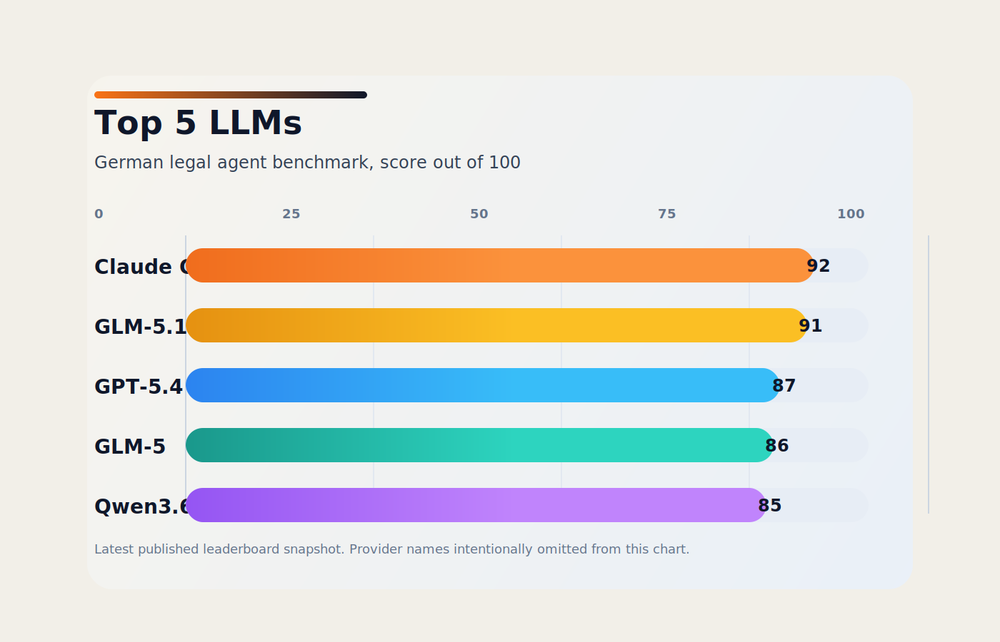

# German Legal Agent Benchmark

This repository contains a small public benchmark for German legal research agents.

The benchmark currently consists of:

- `10` curated legal research cases in [data/cases2021_eval.csv](data/cases2021_eval.csv)
- deduplicated raw result files in [results/](results/)
- a flat leaderboard in [leaderboard.csv](leaderboard.csv)

The cases are short German legal fact patterns paired with gold answers derived from the target case law.

## Leaderboard

Current leaderboard as of `2026-06-12`.

| Rank | Provider | Model | Score | Valid Cases | Avg. on Valid Cases |
| --- | --- | --- | ---: | ---: | ---: |
| 1 | OpenRouter | `anthropic/claude-opus-4.7` | `92/100` | `10/10` | `9.20` |
| 2 | OpenRouter | `z-ai/glm-5.1` | `91/100` | `10/10` | `9.10` |
| 3 | OpenRouter | `openai/gpt-5.4` | `87/100` | `10/10` | `8.70` |
| 4 | OpenRouter | `z-ai/glm-5` | `86/100` | `10/10` | `8.60` |
| 5 | OpenRouter | `qwen/qwen3.6-plus` | `85/100` | `10/10` | `8.50` |
| 6 | OpenRouter | `qwen/qwen3.5-397b-a17b` | `80/100` | `10/10` | `8.00` |
| 7 | Nebius | `zai-org/GLM-5.1` | `75/100` | `8/10` | `9.38` |
| 8 | OpenRouter | `qwen/qwen3.5-122b-a10b` | `51/100` | `9/10` | `5.67` |
| 9 | OpenRouter | `mistralai/mistral-small-3.2-24b-instruct` | `29/100` | `10/10` | `2.90` |
| 10 | Nebius | `PrimeIntellect/INTELLECT-3` | `25/100` | `8/10` | `3.12` |
| 11 | OpenRouter | `mistralai/mistral-large-2512` | `22/100` | `7/10` | `3.14` |
| 12 | Nebius | `NousResearch/Hermes-4-405B` | `21/100` | `10/10` | `2.10` |
| 13 | Nebius | `zai-org/GLM-5` | `16/100` | `8/10` | `2.00` |
| 14 | Nebius | `NousResearch/Hermes-4-70B` | `16/100` | `10/10` | `1.60` |

The Nebius `zai-org/GLM-5.1` run (2026-06-11) has the highest average on valid
cases of any entry: `9.38/10` (≈ 94 %). Its two invalid cases failed on
infrastructure errors (one research timeout, one LLM generation error), which
count as `0` in the summed score, per the method below.

## Method

- Each model is run on the same `10` benchmark cases.
- The research model produces the legal answer.
- The answer is judged against the gold answer by `gpt-5-2025-08-07`.
- The primary score is the sum of per-case scores on a `1-10` scale, reported as `x/100`.
- Some models fail to return a usable final answer on every case. That is why the table also includes `Valid Cases`.

## Files

- [data/cases2021_eval.csv](data/cases2021_eval.csv): benchmark input set
- [leaderboard.csv](leaderboard.csv): machine-readable leaderboard
- [results/openrouter_opus47.csv](results/openrouter_opus47.csv): best current run
- [results/openrouter_glm51.csv](results/openrouter_glm51.csv)
- [results/openrouter_gpt54.csv](results/openrouter_gpt54.csv)
- [results/openrouter_glm5.csv](results/openrouter_glm5.csv)
- [results/openrouter_qwen36_plus.csv](results/openrouter_qwen36_plus.csv)
- [results/openrouter_qwen35_397b_a17b.csv](results/openrouter_qwen35_397b_a17b.csv)
- [results/openrouter_qwen35_122b_a10b.csv](results/openrouter_qwen35_122b_a10b.csv)
- [results/openrouter_mistral_small_32_24b.csv](results/openrouter_mistral_small_32_24b.csv)
- [results/openrouter_mistral_large_2512.csv](results/openrouter_mistral_large_2512.csv)
- [results/nebius_glm51.csv](results/nebius_glm51.csv)
- [results/nebius_intellect3.csv](results/nebius_intellect3.csv)
- [results/nebius_hermes4_405b.csv](results/nebius_hermes4_405b.csv)
- [results/nebius_glm5.csv](results/nebius_glm5.csv)
- [results/nebius_hermes4_70b.csv](results/nebius_hermes4_70b.csv)

## Notes

- The raw CSV result files in this repo are deduplicated to one row per case.
- The benchmark was produced from the LegalGenius evaluation workflow, but this repo is intentionally standalone and only contains the benchmark data and published results.
