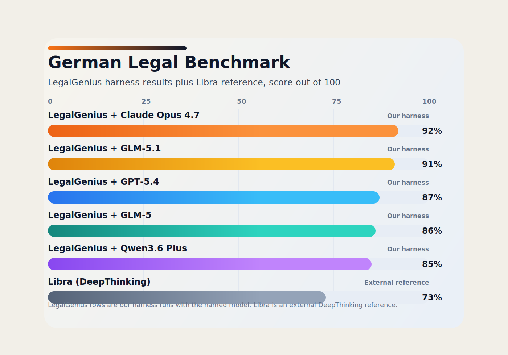

# German Legal Agent Benchmark

This repository contains a small public benchmark for German legal research agents.

The benchmark currently consists of:

- `10` curated legal research cases in [data/cases2021_eval.csv](data/cases2021_eval.csv)
- deduplicated raw result files in [results/](results/)
- a flat LegalGenius harness leaderboard in [leaderboard.csv](leaderboard.csv)

The cases are short German legal fact patterns paired with gold answers derived from the target case law.

## Leaderboard

Current leaderboard as of `2026-06-19`.

Rows marked `LegalGenius` are runs of the same LegalGenius evaluation harness.
The provider and model columns identify the LLM used inside that harness, and the
`Reasoning` column records the thinking level used. The Libra row is an external
reference.

| Rank | Harness | Provider | Model | Reasoning | Score | Valid Cases | Avg. on Valid Cases |
| --- | --- | --- | --- | --- | ---: | ---: | ---: |
| 1 | LegalGenius | Nebius | `zai-org/GLM-5.2` | `high` | `91/100` | `10/10` | `9.10` |
| 2 | LegalGenius | OpenRouter | `anthropic/claude-opus-4.8` | `standard (OpenRouter)` | `91/100` | `10/10` | `9.10` |
| 3 | LegalGenius | OpenRouter | `openai/gpt-5.5` | `high (OpenRouter)` | `91/100` | `10/10` | `9.10` |
| Ref | External reference | Libra | DeepThinking | `DeepThinking` | `73/100` | `10/10` | `7.30` |

`GLM-5.2`, `Claude Opus 4.8` and `GPT-5.5` tie at `91/100` (`9.10` average); GLM-5.2
is listed first. GLM-5.2 ran at reasoning effort `high` on Nebius. The OpenRouter
models: GPT-5.5 ran at reasoning effort `high`; Claude Opus 4.8 ran in `standard`
mode, because its extended thinking is not engageable via OpenRouter (verified — the
`reasoning` parameter produced no thinking tokens and no extra cost), so its `91/100`
is without extended thinking. Libra is shown at its `DeepThinking` mode.

## External Reference

Libra (DeepThinking) is included as a `73/100` (`73%`) external reference in
the README table and chart, with `10/10` valid cases. It is not a LegalGenius
harness run and is therefore not ranked in [leaderboard.csv](leaderboard.csv) or
backed by a raw result file in [results/](results/).

The Nebius `zai-org/GLM-5.2` row is the current published GLM-5.2 benchmark result.
It reached `91/100` with all `10/10` cases valid, at reasoning effort `high`.

## Method

- Each model is run on the same `10` benchmark cases.
- For LegalGenius rows, the LegalGenius harness asks the named research model to
  produce the legal answer.
- The answer is judged against the gold answer by `gpt-5-2025-08-07`.
- The primary score is the sum of per-case scores on a `1-10` scale, reported as `x/100`.
- The `Reasoning` column records the thinking level: GLM-5.2 at `high` (Nebius);
  GPT-5.5 at `high` and Claude Opus 4.8 at `standard` (both via OpenRouter — Opus's
  extended thinking is not engageable through OpenRouter); Libra at `DeepThinking`.
- Some models fail to return a usable final answer on every case. That is why the table also includes `Valid Cases`.
- External references are shown separately when they were not produced by the LegalGenius harness.

## Files

- [data/cases2021_eval.csv](data/cases2021_eval.csv): benchmark input set
- [leaderboard.csv](leaderboard.csv): machine-readable LegalGenius harness leaderboard
- [assets/benchmark-comparison.svg](assets/benchmark-comparison.svg): generated comparison chart
- [generate_benchmark_svg.py](generate_benchmark_svg.py): chart generator
- [results/nebius_glm52_high.csv](results/nebius_glm52_high.csv): GLM-5.2 (Nebius, reasoning `high`)
- [results/openrouter_opus48.csv](results/openrouter_opus48.csv): Claude Opus 4.8 (OpenRouter, standard)
- [results/openrouter_gpt55_high.csv](results/openrouter_gpt55_high.csv): GPT-5.5 (OpenRouter, reasoning high)

## Notes

- The raw CSV result files in this repo are deduplicated to one row per case.
- The benchmark was produced from the LegalGenius evaluation workflow, but this repo is intentionally standalone and only contains the benchmark data and published results.
